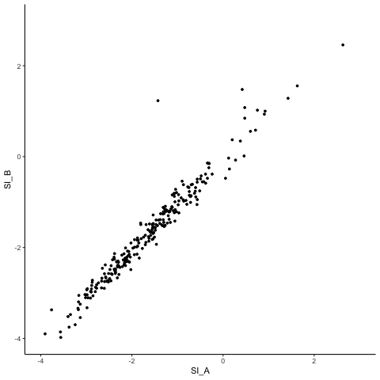

# High-precision detection of pre-mRNA splicing isoforms using Multiplexed Primer Extension sequencing

#### *Michael A. Gildea, Zachary W. Dwyer, and Jeffrey A. Pleiss*

This document contains the data processing and analysis done for "High-precision detection of pre-mRNA splicing isoforms using Multiplexed Primer Extension sequencing" published in Methods. Custom scripts can be found in the "scripts" folder of this project. Questions and comments can be sent to Zach Dwyer at zwd2@cornell.edu.

# Figure 1

## Read Processing

### Genome and Annotation Files
The 2.30 release of the *Schizosaccharomyces pombe* genome was downloaded from [Pombase](ftp://ftp.pombase.org/pombe/genome_sequence_and_features/).

#### Build HISAT index:
Exon and intron ranges were extracted from sp_feature_v2.30.gff3. Hisat indexes were built with intron and exon annotations (indexes available in resources/hisat_index, splice site and exon annotations available in resources).
```
hisat2-build --ss sp_splice_sites.txt --exon sp_exons.txt sp_genome_v2.30.fa sp_index_v2.30
```

### Sample Summary

|**Source** | **Organism** | **Strain** | **Replicate** | **Library Preparation** | **Read Length** | **Sample Name** | **Reads**   |
|-----------|--------------|------------|:-------------:|:-----------------------:|-----------------|-----------------|------------:|
|[SRR8579869](https://trace.ncbi.nlm.nih.gov/Traces/sra/?run=SRR8579869) | *S. pombe* | JP002     | A             | RNA-seq                 | 76             | sp_RNA_A       | 27,112,907 | 
|[SRR8579870](https://trace.ncbi.nlm.nih.gov/Traces/sra/?run=SRR8579870) | *S. pombe* | JP002     | B             | RNA-seq                 | 76             | sp_RNA_B       | 44,827,773 |

### Trimming
Reads are trimmed with [Trimmomatic](http://www.usadellab.org/cms/?page=trimmomatic) (version 0.36) to remove any read through into sequencing adapters which will interfear with alignment. RNA-seq libraries were prepared with TruSeq adapters. TruSeq3-SE.fa came with Trimmomatic and can additionally be found in the "resources" folder of the project. Example commands:
```
java -jar trimmomatic.jar SE -phred33 sp_RNA_A.fastq.gz sp_RNA_A_trim.fastq.gz ILLUMINACLIP:TruSeq3-SE.fa:2:30:10 MINLEN:10
```

### Alignment
Reads were aligned with [HISAT](https://ccb.jhu.edu/software/hisat2/index.shtml) version 2.1.0. Reads with a mapping quality of less than 5 were filtered out (they typically arise from multimapping reads). Example comand:
```
hisat2 --max-intronlen 2000 --summary-file sp_RNA_A_AlignmentSummary.txt --new-summary --no-unal -p 4 -x sp_index_v2.30 -U sp_RNA_A_trim.fastq.gz | samtools view -bh -q 5 - | samtools sort - -o sp_RNA_A.bam
```

Summary of alignment:

|**Sample Name** | **Strain** | **Replicate** | **Library Preparation** | **Reads**  | **Unaligned** | **1 Alignment** | **Multiple Alignments** |
|----------------|------------|:-------------:|-------------------------|-----------:|--------------:|----------------:|------------------------:|
| sp_RNA_A       | JP002     | A             | RNA-seq                  | 26,038,797 | 351,447       | 24,767,961      |  919,389                |
| sp_RNA_B       | JP002     | B             | RNA-seq                  | 44,620,541 | 598,043       | 42,418,370      | 1,604,128               |

### Feature Counting
Mature and premature alignments were counted with a custom script based off of [HTSeq-count](https://htseq.readthedocs.io/en/release_0.11.1/count.html). Mature alignments are those that cross an exon-exon junction. Premature alignments either cross an exon-intron or intron-exon boundary. Results can be found in the "results" folder of this project. This custom script requires the HTSeq library in python.
```
python feature_counts_fig1.py -i sp_RNA_A.bam -f sp_single_intron_features.bed > sp_RNA_A_counts.txt
```

## Analysis

Data were processed in R with the following scripts:

Aesthetic modifications to axis titles were performed in Illustrator

### Figure 1b
```
# Load Libraries
library(ggplot2)
library(dplyr)
library(ggbeeswarm)
library(tidyr)

# Prevent scientific notation in axis
options(scipen=999)

# Read data from sp_rna_A into R, convert raw counts to percentages
sp_rna_counts_A = read.delim('data/counts/sp_RNA_A_counts.txt', header=TRUE) %>% mutate(Total=Exonic+Mature+Premature, Exonic=Exonic/Total, Mature=Mature/Total, Premature=Premature/Total)

# Covert "wide" table format to "long" table format for ease of graphing with ggplot
long = gather(sp_rna_counts_A %>% select(-Total), Type, Percent, Exonic:Premature, factor_key=TRUE)

# Plot
ggplot(long, aes(x=Type, y=Percent, color=Type)) +
  theme_classic() + 
  theme(legend.position = 'none',
        axis.title.x = element_blank()) +
  scale_y_continuous(trans='log10', "Fraction of Alignments") +
  scale_color_manual(values=c("black", "#2166ac", "#b2182b")) +
  geom_quasirandom(na.rm=TRUE, size=.01, dodge.width = .2)
```


### Figure 1c

Coefficient of Variation was calculated as: 


where &sigma; is the sample standard deviation and defined as:


and &mu; is the sample mean and defined as:


```
# Load Libraries
library(ggplot2)
library(dplyr)

# Factor to normalize sample B for read depth
norm = 26035667 / 44616486

# Read data into R, normalize sample B for read depth
sp_rna_counts_A = read.delim('data/counts/sp_RNA_A_counts.txt', header=TRUE)
sp_rna_counts_B = read.delim('data/counts/sp_RNA_B_counts.txt', header=TRUE) %>% mutate(Exonic=Exonic*norm, Mature=Mature*norm, Premature=Premature*norm)

# Merge data sets, calculate Geometric mean, calculate coefficient of varience
sp_rna_counts = merge(sp_rna_counts_A, sp_rna_counts_B, by="Gene", suffixes=c("_A", "_B")) %>% 
  mutate(Exonic_Gmean=sqrt(Exonic_A*Exonic_B), 
         Mature_Gmean=sqrt(Mature_A*Mature_B),
         Premature_Gmean=sqrt(Premature_A*Premature_B),
         Exonic_Amean=(Exonic_A+Exonic_B)/2,
         Mature_Amean=(Mature_A+Mature_B)/2,
         Premature_Amean=(Premature_A+Premature_B)/2,
         Exonic_CoV= sqrt((Exonic_A-Exonic_Amean)^2 + (Exonic_B-Exonic_Amean)^2)/Exonic_Amean,
         Mature_CoV= sqrt((Mature_A-Mature_Amean)^2 + (Mature_B-Mature_Amean)^2)/Mature_Amean,
         Premature_CoV= sqrt((Premature_A-Premature_Amean)^2 + (Premature_B-Premature_Amean)^2)/Premature_Amean)

# Covert from "wide" table format to "long" table format for ease of graphing with ggplot
long = rbind(
    sp_rna_counts %>% select(Gene, Exonic_Gmean, Exonic_CoV) %>% rename(Geo_Mean=Exonic_Gmean, CoV=Exonic_CoV) %>% mutate(Type='Exonic'),
    sp_rna_counts %>% select(Gene, Mature_Gmean, Mature_CoV) %>% rename(Geo_Mean=Mature_Gmean, CoV=Mature_CoV) %>% mutate(Type='Mature'),
    sp_rna_counts %>% select(Gene, Premature_Gmean, Premature_CoV) %>% rename(Geo_Mean=Premature_Gmean, CoV=Premature_CoV) %>% mutate(Type='Premature'))  

# Plot
ggplot(long, aes(x=Geo_Mean, y=CoV, color=Type)) +
  theme_classic() +
  theme(legend.position = "Null") +
  scale_x_continuous(trans='log10') +
  scale_y_continuous(breaks=c(0, .25, .5, .75, 1, 1.25), limits=c(0,1.25)) +
  scale_color_manual(values=c("black", "#2166ac", "#b2182b")) +
  geom_point(size=1,,na.rm=TRUE)
```


# Figure 2

## Read Processing

### Genome and Annotation Files
The R64-2-1 release of the *Saccharomyces cerevisiae* genome was downloaded from the [Saccharomyces Genome Database](https://downloads.yeastgenome.org/sequence/S288C_reference/genome_releases/). The genome sequence was manually removed from the feature file and saved as sc_feature_R64-2-1.gff (available in resources). The chromosome names of the genome file were manually renamed to match the feature file and saved as sc_genome_R64-2-1.fa.

#### Build HISAT index:
Exon and intron ranges were extracted from sc_feature_R64-2-1.gff. Hisat indexes were built with intron and exon annotations (indexes available in resources/hisat_index, splice site and exon annotatios available in resources).
```
python sc_extract_exons_for_hisat.py sc_feature_R64-2-1.gff > sc_exons.txt
python sc_extract_introns_for_hisat.py sc_feature_R64-2-1.gff > sc_splice_sites.txt

hisat2-build --ss sc_splice_sites.txt --exon sc_exons.txt sc_genome_R64-2-1.fa sc_index_R64-2-1
```

### Sample Summary

|**Source** | **Organism** | **Strain** | **Replicate** | **Library Preparation** | **Read Length** | **Sample Name** | **Reads**   |
|-----------|--------------|------------|:-------------:|:-----------------------:|-----------------|-----------------|------------:|
|[SRR7208763](https://trace.ncbi.nlm.nih.gov/Traces/sra/?run=SRR7208763) | *S. cerevisiae* | BY4741     | A             | RNA-seq                 | 101             | sc_RNA_A        | 27,248,124  | 
|[SRR7208770](https://trace.ncbi.nlm.nih.gov/Traces/sra/?run=SRR7208770) | *S. cerevisiae* | BY4741     | B             | RNA-seq                 | 101             | sc_RNA_B        | 30,116,992  |
|[SRR7208774](https://trace.ncbi.nlm.nih.gov/Traces/sra/?run=SRR7208774)         | *S. cerevisiae* | BY4741     | A             | MPE-seq                 | 60+15           | sc_MPE_A        | 4,986,024   | 
|[SRR7208776](https://trace.ncbi.nlm.nih.gov/Traces/sra/?run=SRR7208776)         | *S. cerevisiae* | BY4741     | B             | MPE-seq                 | 60+15           | sc_MPE_B        | 5,803,915   |

### Downsample to 5 Million Reads
Samples were downsampled to 5 million reads by assigning each read a random number, sorting the reads by their random number, and using the first 5 million reads. A seperate script is required for single vs. paired-end reads. All reads from sample sc_MPE_A were used since it consisted of just under 5 million reads. 

#### RNA-seq
```
python downsample_SE.py --input sc_RNA_A.fastq.gz --output sc_RNA_A_ds.fastq.gz -s 1 -n 5000000
```
#### MPE-seq
```
python downsample_PE.py --input_1 sc_MPE_A_R1.fastq.gz --input_2 sc_MPE_A_R2.fastq.gz  --output_1 sc_MPE_A_ds_R1.fastq.gz --output_2 sc_MPE_A_ds_R2.fastq.gz -s 1 -n 5000000
```

### Remove PCR Duplicates [MPE-seq Only]
Reads that resulted from PCR duplicates will have the exact same UMI. Therefore, read 1 and read 2 will be identical. The following script leaves a single copy of identical reads.
```
python compress_UMI.py -n 7 -1 sc_MPE_A_ds_R1.fastq.gz -2 sc_MPE_A_sub_R2.fastq.gz -o sc_MPE_A_compress.fastq.gz
```

### Trimming
Reads are trimmed with [Trimmomatic](http://www.usadellab.org/cms/?page=trimmomatic) (version 0.36) to remove any read through into sequencing adapters which will interfear with alignment. RNA-seq libraries were prepared with TruSeq adapters while MPE-seq libraries were prepared with Nextera adapters. MPE-seq libraries were required to be at least 26 bases long post trimming to remove any reads that come from unextended primers during reverse transcription. TruSeq3-SE.fa and NexteraPE-PE.fa came with Trimmomatic and can additionally be found in the "resources" folder of the project. Example commands:

#### RNA-seq
```
java -jar trimmomatic.jar SE -phred33 sc_RNA_ds_A.fastq.gz sc_RNA_A_trim.fastq.gz ILLUMINACLIP:TruSeq3-SE.fa:2:30:10 MINLEN:10
```
#### MPE-seq
```
java -jar trimmomatic.jar SE -phred33 sc_MPE_A_compress.fastq.gz sc_MPE_A_trim.fastq.gz ILLUMINACLIP:NexteraPE-PE.fa:2:30:10 MINLEN:26
```
Summary of trimming:

| **Sample Name** | **Strain** | **Replicate** | **Library Preparation** | **Reads**  | **Survived** | **Dropped** | **Percent Survived** |
|-----------------|------------|:-------------:|-------------------------|-----------:|-------------:|------------:|---------------------:|
| sc_RNA_A        | BY4741     | A             | RNA-seq                 | 5,000,000  | 4,988,092    | 11,908      | 99.76                |
| sc_RNA_B        | BY4741     | B             | RNA-seq                 | 5,000,000  | 4,988,824    | 11,176      | 99.78                |
| sc_MPE_A        | BY4741     | A             | MPE_seq                 | 3,645,443  | 3,547,620    | 97,823      | 97.32                |
| sc_MPE_B        | BY4741     | B             | MPE_seq                 | 3,467,832  | 3,342,137    | 125,695     | 96.38                |

### Alignment
Reads were aligned with [HISAT](https://ccb.jhu.edu/software/hisat2/index.shtml) version 2.1.0. Reads with a mapping quality of less than 5 were filtered out (they typically arise from multimapping reads). Example comand:
```
hisat2 --max-intronlen 2000 --summary-file sc_RNA_A_AlignmentSummary.txt --new-summary --no-unal -p 4 -x sc_index_R64-2-1 -U sc_RNA_A_trim.fastq.gz | samtools view -bh -q 5 - | samtools sort - -o sc_RNA_A.bam
```
Summary of alignment:

|**Sample Name** | **Strain** | **Replicate** | **Library Preparation** | **Reads**  | **Unaligned** | **1 Alignment** | **Multiple Alignments** |
|----------------|------------|:-------------:|-------------------------|-----------:|--------------:|----------------:|------------------------:|
| sc_RNA_A       | BY4741     | A             | RNA-seq                 | 4,988,092  | 516,496       | 4,205,212       | 266,384                 |
| sc_RNA_B       | BY4741     | B             | RNA-seq                 | 4,988,824  | 396,801       | 4,309,605       | 282,418                 |
| sc_MPE_A       | BY4741     | A             | MPE-seq                 | 3,547,620  | 1,222,690     | 2,272,177       | 52,753                  |
| sc_MPE_B       | BY4741     | B             | MPE-seq                 | 3,342,137  | 1,258,167     | 2,032,509       | 51,461                  |

### Feature Counting
Mature and premature alignments were counted with a custom script based off of [HTSeq-count](https://htseq.readthedocs.io/en/release_0.11.1/count.html). Mature alignments are those that cross an exon-exon junction. Premature alignments either cross an exon-intron or intron-exon boundary. Results can be found in the "results" folder of this project. This custom script requires the HTSeq library in python.
```
python feature_counts_fig2.py -i sc_RNA_A.bam -f sc_intron_ranges.bed > sc_RNA_A_counts.txt
```

## Analysis

### Figure 2C

Data were processed in R with the following scripts:

For each method, introns without at least one mature and one premature read in both replicates were filtered out. Additionally snR17a and snR17b were removed as they cannot be differentiated by our MPE-seq primers. 

Splice Index was calculated as premature reads divided by mature reads.

Aesthetic modifications to axis titles and addition of title, n and R<sup>2</sup> were performed in Illustrator

#### MPE-seq
```
# Load Libraries
library(ggplot2)
library(dplyr)

# Read data into R
sc_mpe_counts_A = read.delim('data/counts/sc_MPE_A_counts.txt', header=TRUE)
sc_mpe_counts_B = read.delim('data/counts/sc_MPE_B_counts.txt', header=TRUE)

# Merge, filter, calculate splice index
sc_mpe_counts = merge(sc_mpe_counts_A, sc_mpe_counts_B, by="Intron", suffixes=c("_A", "_B")) %>% filter(Mature_A > 0 & Premature_A > 0 & Mature_B > 0 & Premature_B > 0) %>% mutate(SI_A=log10(Premature_A/Mature_A),SI_B=log10(Premature_B/Mature_B)) %>% select(Intron, SI_A, SI_B)

# Number of introns that passed filter:
nrow(sc_mpe_counts)

# R-squared was calculated by:
summary(lm(sc_mpe_counts %>% select(SI_A,SI_B)))$r.squared

# Plot
ggplot(sc_mpe_counts, aes(x=SI_A, y=SI_B)) +
          theme_classic() +
          theme(panel.grid = element_blank()) +
          scale_x_continuous(limits=c(-4,3)) +
          scale_y_continuous(limits=c(-4,3)) +
          geom_point(size=1)
```



#### RNA-seq
```
# Load Libraries
library(ggplot2)
library(dplyr)

# Read data into R
sc_rna_counts_A = read.delim('data/counts/sc_RNA_A_counts.txt', header=TRUE)
sc_rna_counts_B = read.delim('data/counts/sc_RNA_B_counts.txt', header=TRUE)

# Merge, filter, calculate splice index
sc_rna_counts = merge(sc_rna_counts_A, sc_rna_counts_B, by="Intron", suffixes=c("_A", "_B")) %>% filter(Mature_A > 0 & Premature_A > 0 & Mature_B > 0 & Premature_B > 0) %>% mutate(SI_A=log10(Premature_A/Mature_A),SI_B=log10(Premature_B/Mature_B)) %>% select(Intron, SI_A, SI_B)

# Number of introns that passed filter:
nrow(sc_rna_counts)

# R-squared was calculated by:
summary(lm(sc_rna_counts %>% select(SI_A,SI_B)))$r.squared

# Plot
ggplot(sc_rna_counts, aes(x=SI_A, y=SI_B)) +
          theme_classic() +
          theme(panel.grid = element_blank()) +
          scale_x_continuous(limits=c(-4,3)) +
          scale_y_continuous(limits=c(-4,3)) +
          geom_point(size=1)
```
